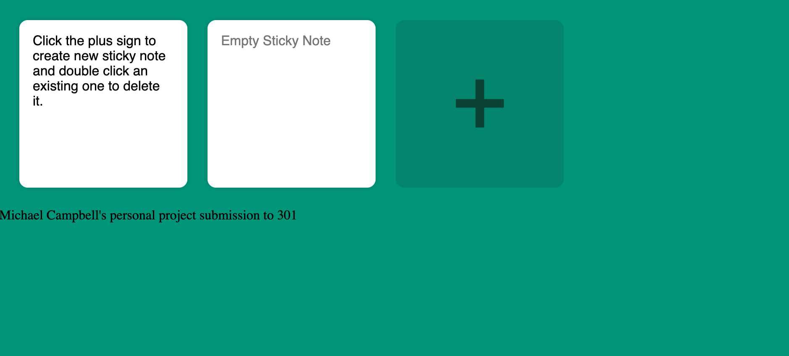

# Sticky Notes App
## Project by Michael Campbell
### This project is my submission to test into Code 301.

This project demonstrates CRUD and utilizes local storage and event listeners. The data input from user persists through a browser refresh.

[GitHub Repo](https://github.com/MichaelCampbell-on3001/stickynotes)

[project URL](https://michaelcampbell-on3001.github.io/stickynotes/)

