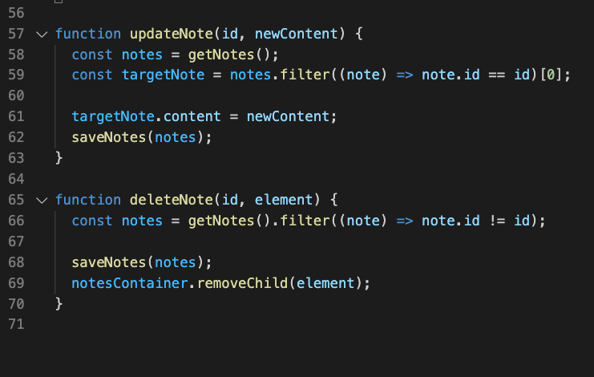

# Sticky Notes App
## Project by Michael Campbell
### This project is my submission to test into Code 301.

[GitHub Repo](https://github.com/MichaelCampbell-on3001/stickynotes)

[project URL](https://michaelcampbell-on3001.github.io/stickynotes/)

For my project, I was tasked with utilizes local storage, have persisting data from the user and event listeners. The data can be input from user onto a "sticky note" and the data persists through a browser refresh. Below I will break down my process. 

# The Process

- HTML Layout
- CSS Layout
- Javascript Functionality

## HTML Layout

In the below screenshot you can see I started with boilerplate HTML, added links to my CSS and Javascript folders and added a div to house the entire app. 

## CSS Layout

I decided early on that a grid layout would work best for this application. As the sticky notes are added they snap into the grid an align with existing and new notes.

## Javascript Functionality

In additional to having the user's saved notes persist through a browser refresh, I also wanted to provide the user with the options to create, edit and delete a note. Below I will breakdown how I did this. 

To approach this project, I first laid out each function I knew I wanted. 

First, I wanted to check to see if a user already has any notes saved, so we check the browser storage first. 

If the user wants to add a new sticky note, this function aloows the user to create a new note instance.

When the user wants to update an excisting note, this function makes it possible. 

