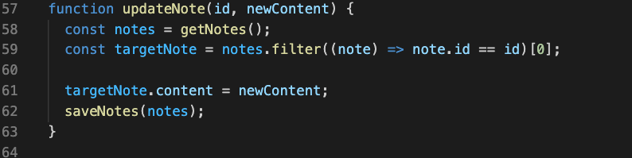

# Sticky Notes App
## Project by Michael Campbell
### This project is my submission to test into Code 301.

[GitHub Repo](https://github.com/MichaelCampbell-on3001/stickynotes)

[Project URL](https://michaelcampbell-on3001.github.io/stickynotes/)

For my project, I was tasked with creating an application that utilizes local storage, has persisting data from the user and event listeners. The data can be input from the user onto a "sticky note" and the data persists through a browser refresh. Below I will break down my process. 

# The Process

- HTML Layout
- CSS Layout
- Javascript Functionality

## HTML Layout

In the below screenshot you can see I started with boilerplate HTML, added links to my CSS and Javascript folders and added a div to house the entire app. 

I then added a text area to give myself a place to put the application's instructions and added an html button.

## CSS Layout

I decided early on that a grid layout would work best for this application. As the sticky notes are added they snap into the grid and align with existing notes.

The grid layout brought a lot of clarity and order to the app. It also allows the user to add a new note to the page without a lot of clutter.

## Javascript Functionality

In additional to having the user's saved notes persist through a browser refresh, I also wanted to provide the user with the options to create, edit and delete a note. Below I will breakdown how I did this. 

To approach this project, I first laid out each function I knew I wanted. 

First, I wanted to check to see if a user already has any notes saved, so we check the browser storage first. If they dont, then the process continues and the user is given a fresh set of sticky notes. If the user does have saved notes, then those notes will be retrieved from local storage and displayed to the user. 

If the user wants to add a new sticky note, this function allows the user to create a new note.

When the user wants to update an existing note, this function makes it possible. 

Below is the function enabling the delete feature.

## Stretch goal

One stretch goal I had in mind when I thougt of this idea was to give the user the ability to reorganize the sticky notes into any order they wanted.

